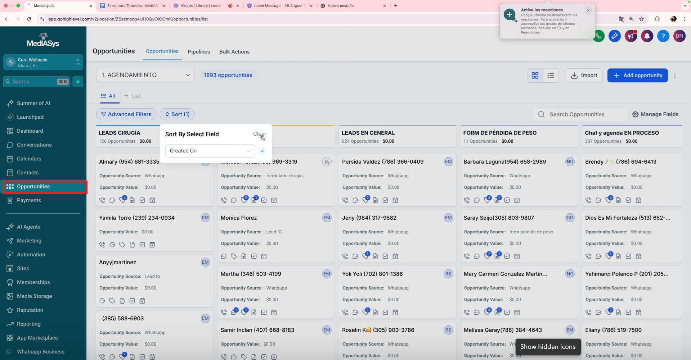
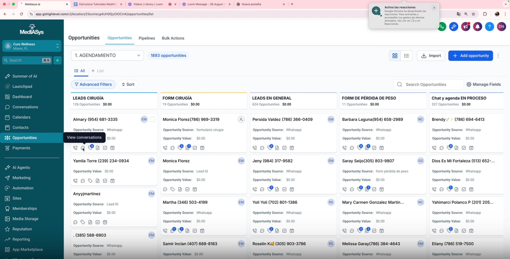
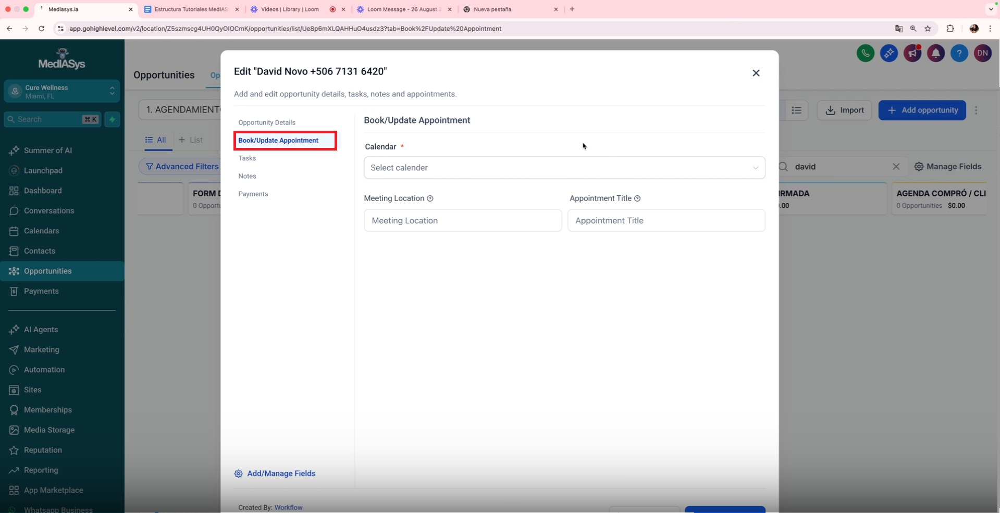
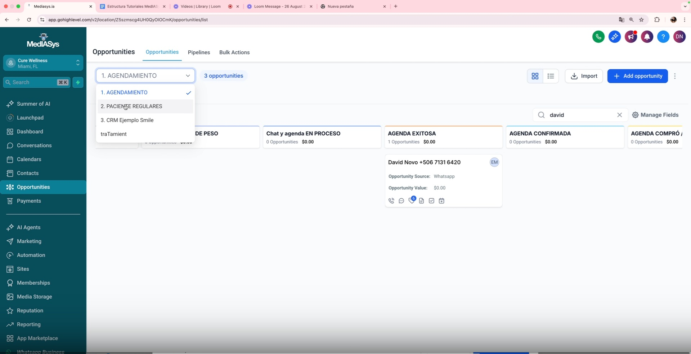
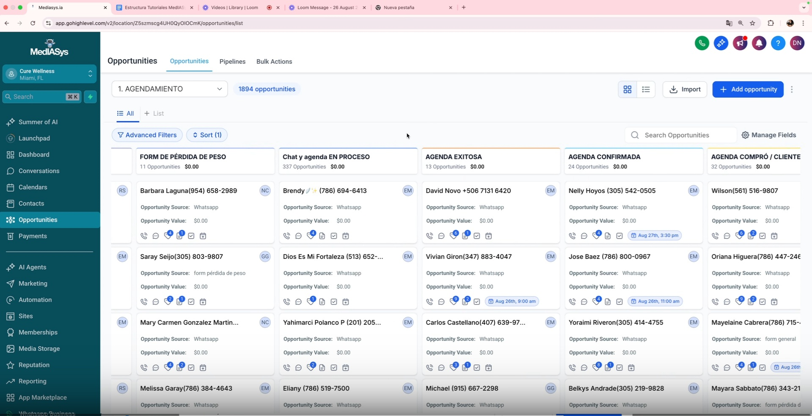

# Procedimiento Operativo Estándar para el Uso del CRM

# Objective
Este SOP proporciona una guía clara y concisa para gestionar oportunidades y clientes potenciales utilizando el sistema CRM según el negocio.

<iframe src="https://www.loom.com/embed/d8b20dc983c147a5aa3d57c12cf44bd3?sid=33eabb36-82a3-444e-9c3f-2251d0b08b0a" frameborder="0" webkitallowfullscreen mozallowfullscreen allowfullscreen style="position: absolute; top: 0; left: 0; width: 100%; height: 100%;"></iframe>

## 1. Introducción al CRM 0:02

El CRM (Customer Relationship Management) es una herramienta para gestionar relaciones con clientes y leads.
Permite llevar un control de los clientes potenciales interesados en servicios específicos.
 
## 2. Personalización del CRM 0:44

- Cada clínica tiene un CRM personalizado según sus necesidades.
- Se realizan modificaciones continuas para optimizar el funcionamiento.
 
## 3. Gestión de Leads 1:23

- Los leads pueden provenir de diferentes fuentes como cirugía, valoraciones, Instagram o WhatsApp.
- Es importante clasificar a los leads según la etapa en la que se encuentran.
 
## 4. Herramientas del CRM 2:23

- Acceder a conversaciones para revisar interacciones previas con el lead.
- Cambiar la etapa del lead según su progreso en el proceso de agendamiento.
 
## 5. Cambiar la Etapa del Lead 4:28

- Seleccionar el pipeline correspondiente y mover el lead a la etapa adecuada (ej. de cirugía a agenda exitosa).
- Utilizar la opción de arrastrar o hacer clic en el cuadro para cambiar la etapa.
 
## 6. Agregar Notas y Etiquetas 6:35

- Agregar notas relevantes sobre el lead para mantener un registro claro.
- Utilizar etiquetas para clasificar y segmentar leads según características específicas.
 
## 7. Agendar Citas 9:08

- Aunque se puede agregar una cita desde el CRM, se recomienda usar la sección de calendarios para una mejor gestión.
 
## 8. Seguimiento de Leads 12:01

- Es crucial dar seguimiento a los leads para mantener la trazabilidad y medir resultados.
- Clasificar correctamente los leads para evitar pérdidas de información.
 
## 9. Personalización Adicional 13:02

- Si se requieren etapas o clasificaciones adicionales, se puede solicitar personalización del CRM.

